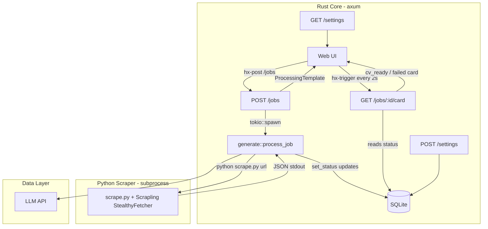

# AI Job Application Agent - Comprehensive Architecture Specification

## 1. System Overview & Design Philosophy

This document outlines the complete architecture for an autonomous, AI-driven job application agent. The system scrapes job postings from Indonesian job boards, generates highly tailored CVs based on a master profile, and queues them for user approval before submission.

### 1.1. Scope & Phasing

`indonesia_job_sites_scraping_targets.xlsx` enumerates 43 Indonesian job boards across 6 categories (General, Tech, Freelance, Entry-Level, Government, Remote-First). Supporting all of them up front is speculative — selectors, pagination, and bot-detection differ per site. **Phase 1 ships exactly one site end-to-end; the rest are deferred until the pipeline is proven.**

| Phase | Scope | Exit criteria |
|-------|-------|---------------|
| **1 (current)** | **JobStreet Indonesia** (`jobstreet.co.id`) only — individual job URL → scrape → CV → approve/reject | One JobStreet URL flows through the full UI without manual intervention; selectors stable across 10 sample URLs |
| 2 (later) | Add sites one at a time, ordered by the xlsx category priority: General first (Karir.com, Kalibrr), then Tech (Glints), then the rest | Each site gets its own selector profile only when its first URL is tested |
| 3 (later) | Listing/discovery mode (scrape `…/jobs` index pages, surface many jobs at once) | Only if Phase 1+2 per-URL flow proves insufficient — YAGNI until then |

**Phase 1 contract:** the user pastes a single `https://www.jobstreet.co.id/jobs/…` URL. Everything outside that — other domains, listing pages, batch imports — is out of scope and should be rejected with a clear error, not silently attempted.

### 1.2. Technology Stack
| Layer | Choice | Why |
|-------|--------|-----|
| Backend | Rust + axum | Compiler errors as dev feedback loop; reliable long-running async |
| UI | HTMX + askama + Pico CSS | No JS framework; template errors are `cargo check` errors; zero-build CSS |
| Live status | HTMX polling | `hx-trigger="every 2s"` swaps the card when the job finishes; no SSE, no extra deps |
| Scraper | Python + Scrapling | Scrapling is Python-only; invoked as a subprocess, JSON on stdout |
| Database | SQLite + sqlx | Single-user local file; `sqlx-cli` for migrations; zero daemon |
| LLM | Configurable via env | `LLM_MOCK=true` returns hardcoded JSON for offline dev |

### 1.3. Module Structure

```
Makefile                  dev target: migrate + run (SQLite, no Docker)
scrape.py                 Python scraper, invoked as a subprocess

src/
  main.rs                 AppState, axum router, all route handlers
  generate.rs             job pipeline: scrape subprocess, prompt, LLM
  db.rs                   all sqlx query functions
  templates.rs            all askama Template structs

templates/
  base.html               <head>, Pico CSS, HTMX (CDN), nav
  index.html              dashboard: job list + submit form
  job.html                two-panel CV review
  settings.html           master CV editor
  fragments/
    job_row.html          single job row
    processing.html       polling card (hx-trigger every 2s)
    cv_ready.html         terminal card shown when generation completes

migrations/
  0001_init.sql           initial schema (run via sqlx-cli)
```

### 1.4. High-Level Architecture Diagram



---

## 2. Development Environment

### 2.1. Prerequisites

```bash
# Arch Linux
pacman -S rustup python python-pip sqlite
cargo install cargo-watch sqlx-cli
pip install scrapling
```

### 2.2. Makefile

SQLite is a local file — no daemon, no Docker. The scraper is a subprocess Rust spawns per job, so there is nothing to start or stop alongside the server.

```makefile
.PHONY: dev migrate

DATABASE_URL = sqlite://jobagent.db

migrate:
	DATABASE_URL=$(DATABASE_URL) sqlx database create
	DATABASE_URL=$(DATABASE_URL) sqlx migrate run

dev: migrate
	DATABASE_URL=$(DATABASE_URL) cargo watch -x run
```

### 2.3. Mock LLM Mode

Set `LLM_MOCK=true` in your shell to skip real LLM calls during development. The mock returns a valid hardcoded JSON CV so the full UI flow works offline.

```bash
LLM_MOCK=true make dev
```

### 2.4. Brave Profile Strategy

`scrape.py` copies the host Brave profile to a permanent path on first run, not `/tmp` (which is wiped on reboot). The check is `WORK_PROFILE.exists()`, so every later run skips the copy — startup is instant.

```
~/.local/share/job-agent/brave-profile/   ← permanent copy
```

Force a re-sync after logging into new job board accounts by deleting the copy; the next scrape recreates it:

```bash
rm -rf ~/.local/share/job-agent/brave-profile
```

---

## 3. Database Schema

One CV per job, stored as a JSON column on the job row — no separate versions table, no full-text index (there is no search feature).

**`migrations/0001_init.sql`**
```sql
CREATE TABLE jobs (
    id TEXT PRIMARY KEY,                 -- uuid v4 as TEXT: Uuid::new_v4().to_string()
    url TEXT UNIQUE NOT NULL,
    title TEXT,
    description TEXT,
    cv TEXT,                             -- JSON CV the LLM returned (one per job)
    -- new | scraping | generating | pending_approval | approved | rejected | failed
    status TEXT DEFAULT 'new'
);

-- Single-row settings table; upsert on save
CREATE TABLE settings (
    id INTEGER PRIMARY KEY CHECK (id = 1),
    master_cv TEXT NOT NULL DEFAULT ''
);
INSERT INTO settings (id, master_cv) VALUES (1, '');
```

---

## 4. Python Scraper

**Phase 1 scope:** a plain CLI script invoked once per job with a single `jobstreet.co.id` URL. Not a service, not a crawler — Rust spawns it as a subprocess: `python scrape.py <url>`. It prints `{"title", "description"}` as JSON on stdout; any failure exits non-zero with a traceback on stderr, which Rust logs. Non-JobStreet URLs should be rejected by the caller (Rust) before reaching the scraper; the scraper assumes a JobStreet job-detail page. The Brave profile is copied once on first run (`rm -rf` the copy to resync — see §2.4).

Selectors below are tuned for `jobstreet.co.id` job-detail pages. They will need adjustment per site in Phase 2; do not generalize prematurely.

**`scrape.py`**
```python
# Invoked as: python scrape.py <url>  →  prints {"title", "description"} JSON on stdout.
# ponytail: selectors hardcoded for jobstreet.co.id; add a per-site profile map in Phase 2
import sys, json, shutil, asyncio
from pathlib import Path
from scrapling.fetchers import StealthyFetcher

BRAVE_BIN     = "/usr/bin/brave-browser"
BRAVE_PROFILE = Path.home() / ".config" / "BraveSoftware" / "Brave-Browser"
WORK_PROFILE  = Path.home() / ".local" / "share" / "job-agent" / "brave-profile"


def ensure_profile():
    WORK_PROFILE.parent.mkdir(parents=True, exist_ok=True)
    if WORK_PROFILE.exists():
        return  # already copied; rm -rf this dir to resync after new logins
    shutil.copytree(BRAVE_PROFILE, WORK_PROFILE, symlinks=True)
    lock = WORK_PROFILE / "SingletonLock"
    if lock.exists() or lock.is_symlink():
        try: lock.unlink()
        except OSError: pass


async def scrape(url: str) -> dict:
    fetcher = StealthyFetcher(
        user_data_dir=str(WORK_PROFILE),
        executable_path=BRAVE_BIN,
        headless=True,
        args=["--disable-blink-features=AutomationControlled",
              "--no-sandbox", "--disable-dev-shm-usage"],
    )
    page = await fetcher.fetch(url, network_idle=True)
    # JobStreet job-detail selectors. title first; fall back to h1 if the
    # data-automation attribute is renamed.
    title = (page.css_first('[data-automation="job-detail-title"]::text')
             or page.css_first('h1::text') or "")
    desc  = (page.css_first('[data-automation="jobDescriptionText"]')
             or page.css_first('[data-automation="jobDescription"]'))
    return {"title": title.strip(),
            "description": desc.text.strip() if desc else ""}


if __name__ == "__main__":
    ensure_profile()
    print(json.dumps(asyncio.run(scrape(sys.argv[1]))))
```

---

## 5. Rust Core

### 5.1. Cargo.toml

```toml
[package]
name    = "job-agent"
version = "0.1.0"
edition = "2021"

[dependencies]
axum        = { version = "0.7", features = ["macros", "form"] }
tokio       = { version = "1",   features = ["full"] }
sqlx        = { version = "0.7", features = ["runtime-tokio", "sqlite", "uuid"] }
reqwest     = { version = "0.12", features = ["json"] }
serde       = { version = "1",   features = ["derive"] }
serde_json  = "1"
uuid        = { version = "1",   features = ["v4"] }
anyhow      = "1"
askama      = "0.12"
askama_axum = "0.4"
```

### 5.2. AppState

**`src/main.rs`**
```rust
#[derive(Clone)]
pub struct AppState {
    pub db:           sqlx::SqlitePool,
    pub http:         reqwest::Client,   // LLM calls only; scraper is a subprocess
    pub llm_endpoint: String,
    pub llm_api_key:  String,
    pub llm_model:    String,
    pub mock_llm:     bool,   // LLM_MOCK set → skip real API calls
}

impl AppState {
    pub fn from_env(db: sqlx::SqlitePool) -> Self {
        Self {
            db,
            http:         reqwest::Client::new(),
            llm_endpoint: std::env::var("LLM_ENDPOINT").expect("LLM_ENDPOINT required"),
            llm_api_key:  std::env::var("LLM_API_KEY").expect("LLM_API_KEY required"),
            llm_model:    std::env::var("LLM_MODEL")
                              .unwrap_or("claude-sonnet-4-6".into()),
            mock_llm:     std::env::var("LLM_MOCK").is_ok(),
        }
    }
}
```

### 5.3. Template Structs

**`src/templates.rs`**
```rust
use askama::Template;
use uuid::Uuid;

#[derive(Template)]
#[template(path = "index.html")]
pub struct IndexTemplate {
    pub jobs: Vec<JobRow>,
}

pub struct JobRow {
    pub id:     Uuid,
    pub title:  String,
    pub status: String,
}

#[derive(Template)]
#[template(path = "job.html")]
pub struct JobTemplate {
    pub id:          Uuid,
    pub title:       String,
    pub description: String,
    pub cv:          CvContent,
}

pub struct CvContent {
    pub summary:     String,
    pub skills:      Vec<String>,
    pub experiences: Vec<Experience>,
}

pub struct Experience {
    pub company:       String,
    pub role:          String,
    pub bullet_points: Vec<String>,
}

#[derive(Template)]
#[template(path = "fragments/processing.html")]
pub struct ProcessingTemplate {
    pub id:  Uuid,
    pub url: String,
}

#[derive(Template)]
#[template(path = "fragments/cv_ready.html")]
pub struct CvReadyTemplate {
    pub id:    Uuid,
    pub title: String,
}

#[derive(Template)]
#[template(path = "settings.html")]
pub struct SettingsTemplate {
    pub master_cv: String,
}
```

### 5.4. Scrape Helper (subprocess, in `generate.rs`)

```rust
use tokio::time::{sleep, Duration};

// ponytail: subprocess, 3s courtesy delay + one retry; add backoff if bot-detection bites
async fn fetch_job(url: &str) -> anyhow::Result<serde_json::Value> {
    sleep(Duration::from_secs(3)).await;
    if let Ok(v) = scrape_once(url).await {
        return Ok(v);
    }
    sleep(Duration::from_secs(10)).await;
    scrape_once(url).await
}

async fn scrape_once(url: &str) -> anyhow::Result<serde_json::Value> {
    let out = tokio::process::Command::new("python")
        .arg("scrape.py").arg(url)
        .output().await?;
    anyhow::ensure!(out.status.success(),
        "scrape.py failed: {}", String::from_utf8_lossy(&out.stderr));
    Ok(serde_json::from_slice(&out.stdout)?)
}
```

### 5.5. Prompt Builder (in `generate.rs`)

```rust
use serde_json::Value;

fn build_prompt(task: &str, context: Value, output_schema: Value) -> String {
    let ctx    = serde_json::to_string_pretty(&context).unwrap_or_default();
    let schema = serde_json::to_string_pretty(&output_schema).unwrap_or_default();
    format!(r###"
### CONTEXT
{ctx}
### TASK
{task}
### OUTPUT FORMAT
Return ONLY valid JSON matching this exact structure. No markdown, no explanation.
{schema}
"###)
}
```

### 5.6. CV Generation Pipeline

Job record is created before spawning so the polling fragment has an ID to watch immediately. Errors set status to `failed` so the next poll surfaces them to the user.

**`src/generate.rs`**
```rust
use anyhow::Result;
use serde_json::{json, Value};
use uuid::Uuid;
use crate::{AppState, db};

pub async fn process_job(app: &AppState, job_id: Uuid) -> Result<()> {
    db::set_status(&app.db, job_id, "scraping").await?;

    let url        = db::get_job_url(&app.db, job_id).await?;
    let job_data   = fetch_job(&url).await?;
    db::update_job_data(&app.db, job_id, &job_data).await?;

    db::set_status(&app.db, job_id, "generating").await?;

    let master_cv  = db::get_master_cv(&app.db).await?;
    let context    = json!({
        "job_description": job_data["description"],
        "master_cv":       master_cv,
    });
    let task = "Analyze master_cv against job_description. \
                Extract and rephrase experiences to match the job requirements.";
    let schema = json!({
        "summary":     "String: 2-3 sentences tailored to the job.",
        "skills":      ["Array of strings: technical skills matching JD"],
        "experiences": [{"company": "String", "role": "String",
                         "bullet_points": ["achievement-focused, quantified"]}]
    });

    let cv = call_llm(app, &build_prompt(task, context, schema)).await?;
    db::save_cv_draft(&app.db, job_id, cv).await?;   // UPDATE jobs SET cv = ?  (bind cv.to_string())
    db::set_status(&app.db, job_id, "pending_approval").await?;
    Ok(())
}

async fn call_llm(app: &AppState, prompt: &str) -> Result<Value> {
    if app.mock_llm {
        // ponytail: mock returns valid structure so full UI flow works offline
        return Ok(json!({
            "summary": "Mock summary for development.",
            "skills": ["Rust", "Python", "PostgreSQL"],
            "experiences": [{
                "company": "Mock Corp",
                "role": "Mock Engineer",
                "bullet_points": ["Achieved mock results", "Delivered mock features"]
            }]
        }));
    }
    // Real LLM call via LLM_ENDPOINT / LLM_API_KEY / LLM_MODEL
    let resp = app.http
        .post(&app.llm_endpoint)
        .bearer_auth(&app.llm_api_key)
        .json(&json!({ "model": app.llm_model, "prompt": prompt }))
        .send().await?
        .json::<Value>().await?;
    Ok(resp)
}
```

### 5.7. Routes & Polling

**`src/main.rs` (route handlers)**
```rust
// POST /jobs — create stub record, spawn background task, return polling card immediately.
// ponytail: Phase 1 — reject non-jobstreet.co.id URLs at the boundary, not in the scraper
async fn submit_job(
    State(app): State<AppState>,
    Form(body): Form<JobForm>,
) -> impl IntoResponse {
    if !is_phase1_url(&body.url) {
        return Html(
            "<article><span class=\"error\">Phase 1 supports jobstreet.co.id URLs only.</span></article>"
        ).into_response();
    }
    let job_id = db::create_job_stub(&app.db, &body.url).await
        .expect("failed to create job record");

    tokio::spawn({
        let app = app.clone();
        async move {
            if let Err(e) = generate::process_job(&app, job_id).await {
                eprintln!("process_job {job_id} failed: {e}");
                let _ = db::set_status(&app.db, job_id, "failed").await;
            }
        }
    });

    ProcessingTemplate { id: job_id, url: body.url }.into_response()
}

// ponytail: hardcoded host allowlist; replace with config-driven list in Phase 2
fn is_phase1_url(url: &str) -> bool {
    reqwest::Url::parse(url).ok()
        .and_then(|u| u.host_str().map(|h| h == "www.jobstreet.co.id" || h == "jobstreet.co.id"))
        .unwrap_or(false)
}

// GET /jobs/:id/card — HTMX polls this every 2s; the returned card stops polling
// at a terminal status (no hx-trigger on the ready/failed fragments).
async fn job_card(
    Path(job_id): Path<Uuid>,
    State(app): State<AppState>,
) -> Response {
    match db::get_status(&app.db, job_id).await.unwrap_or_default().as_str() {
        "pending_approval" => db::render_cv_ready(&app.db, job_id).await.into_response(),
        "failed" => Html(format!(
            "<article id=\"job-{job_id}\"><span class=\"error\">Processing failed.</span></article>"
        )).into_response(),
        // still in-flight → re-render the polling card so hx-trigger keeps firing
        _ => {
            let url = db::get_job_url(&app.db, job_id).await.unwrap_or_default();
            ProcessingTemplate { id: job_id, url }.into_response()
        }
    }
}

pub fn router(state: AppState) -> Router {
    Router::new()
        .route("/",                  get(index))
        .route("/jobs",              post(submit_job))
        .route("/jobs/:id",          get(job_detail))
        .route("/jobs/:id/card",     get(job_card))
        .route("/jobs/:id/decision", post(job_decision))
        .route("/settings",          get(settings_page).post(save_settings))
        .with_state(state)
}
```

---

## 6. Web UI

### 6.1. Base Template

**`templates/base.html`**
```html
<!DOCTYPE html>
<html lang="en" data-theme="light">
<head>
  <meta charset="utf-8">
  <meta name="viewport" content="width=device-width, initial-scale=1">
  <title>Job Agent</title>
  <link rel="stylesheet"
        href="https://cdn.jsdelivr.net/npm/@picocss/pico@2/css/pico.min.css">
  <script src="https://cdn.jsdelivr.net/npm/htmx.org@2/dist/htmx.min.js"></script>
</head>
<body>
  <main class="container">
    <nav>
      <ul><li><strong>Job Agent</strong></li></ul>
      <ul>
        <li><a href="/">Jobs</a></li>
        <li><a href="/settings">Settings</a></li>
      </ul>
    </nav>
    
  </main>
</body>
</html>
```

### 6.2. Dashboard

**`templates/index.html`**
```html


<form hx-post="/jobs" hx-target="#job-list" hx-swap="afterbegin">
  <input name="url" type="url"
         placeholder="Paste a jobstreet.co.id job URL…"
         pattern="https?://([a-z.]+\.)?jobstreet\.co\.id/.*"
         title="Phase 1 supports jobstreet.co.id URLs only"
         required>
  <button type="submit">Process</button>
</form>
<div id="job-list">
  
</div>

```

### 6.3. Polling Fragment Flow

Submit returns `processing.html` immediately. The fragment polls `GET /jobs/:id/card` every 2s and swaps itself with the result. The card it gets back keeps the `hx-trigger` while the job is in-flight and drops it once the job reaches `pending_approval` (CV ready) or `failed` — so polling stops on its own.

**`templates/fragments/processing.html`**
```html
<article id="job-{{ id }}"
         hx-get="/jobs/{{ id }}/card"
         hx-trigger="every 2s"
         hx-swap="outerHTML"
         aria-busy="true">
  Processing {{ url }}…
</article>
```

**`templates/fragments/cv_ready.html`**
```html
<article id="job-{{ id }}">
  <strong>{{ title }}</strong>
  <a href="/jobs/{{ id }}" role="button" class="outline">Review CV →</a>
</article>
```

### 6.4. CV Review Page

**`templates/job.html`**
```html


<div class="grid">
  <section>
    <h2>Job Description</h2>
    <pre style="white-space:pre-wrap">{{ description }}</pre>
  </section>
  <section>
    <h2>Generated CV</h2>
    <p>{{ cv.summary }}</p>
    <ul><li>{{ s }}</li></ul>
    
      <h3>{{ exp.role }} — {{ exp.company }}</h3>
      <ul><li>{{ bp }}</li></ul>
    

    <div style="display:flex; gap:0.5rem; margin-top:1rem">
      <button hx-post="/jobs/{{ id }}/decision"
              hx-vals='{"approved":true}'>Approve</button>
      <button class="secondary"
              onclick="document.getElementById('reject-box').style.display='block'">
        Reject
      </button>
    </div>

    <!-- Hidden until Reject is clicked -->
    <div id="reject-box" style="display:none; margin-top:0.5rem">
      <textarea id="reason" name="reason"
                placeholder="Reason for rejection…"
                style="width:100%"></textarea>
      <button hx-post="/jobs/{{ id }}/decision"
              hx-vals='{"approved":false}'
              hx-include="#reason"
              style="margin-top:0.5rem">
        Confirm Reject
      </button>
    </div>
  </section>
</div>

```

### 6.5. Settings Page (Master CV)

**`templates/settings.html`**
```html

Settings

<h1>Master CV</h1>
<p>Paste your full CV here. This is the source material for all generated CVs.</p>
<form hx-post="/settings" hx-swap="none">
  <textarea name="master_cv" rows="30"
            style="width:100%; font-family:monospace">{{ master_cv }}</textarea>
  <button type="submit">Save</button>
</form>

```

### 6.6. Environment Variables

| Variable | Required | Description |
|----------|----------|-------------|
| `DATABASE_URL` | Yes | SQLite connection string (e.g. `sqlite://jobagent.db`) |
| `LLM_API_KEY` | Yes | API key for the generation model |
| `LLM_ENDPOINT` | Yes | Base URL of the LLM API |
| `LLM_MODEL` | No | Model ID (default: `claude-sonnet-4-6`) |
| `LLM_MOCK` | No | Set to any value to skip real LLM calls |

---

## 7. Execution Lifecycle

1. **First run:** `make dev` creates `jobagent.db` and runs migrations. On the first scrape, `scrape.py` copies the Brave profile to `~/.local/share/job-agent/brave-profile` (once, ~1 minute). Every later run skips it.
2. **Input:** User pastes a job URL and hits **Process**. Job record created with `status='new'`.
3. **Immediate response:** Server spawns `process_job` in the background; returns `processing.html` to the browser. HTMX prepends it to the job list. The fragment polls `/jobs/:id/card` every 2s.
4. **Scraping:** `fetch_job` waits 3s, runs `python scrape.py <url>` as a subprocess. Status → `scraping`. The script renders the page with Brave and prints JSON on stdout.
5. **Generation:** `build_prompt` assembles the prompt from job description + master CV. Status → `generating`. LLM returns structured JSON CV (or mock if `LLM_MOCK` is set).
6. **Poll resolves:** Status → `pending_approval`. The next `/card` poll returns `cv_ready.html` (no `hx-trigger`, so polling stops). If `process_job` errors at any step, status → `failed` and `/card` returns the failed card.
7. **Review:** User clicks **Review CV →**, sees side-by-side job description and generated CV.
8. **Decision:** User clicks **Approve** or **Reject** (with confirm step + reason textarea). Status updated in database.

---

## 8. Multi-Agent Workspace

Multiple agents work this repo in parallel — they cannot share a single working directory without colliding on file edits and the `target/` build cache. The project uses a **bare repo + worktree** layout: one bare hub holds all commits and branches; each agent works in its own worktree (a sibling directory with a full file checkout but sharing commit history).

**Agent action card:** `.opencode/skills/worktree/SKILL.md` — the short-form workflow every agent reads before editing files. This section is the reference; the skill is the dispatch.

### 8.1 Layout

```
JobHunting/                  ← project root; no working files live here
├── .bare/                   ← bare repo (commit/branch storage; never edited directly)
├── .git                     ← file containing `gitdir: ./.bare` (so git works from root)
├── .env                     ← shared dev env (gitignored, lives outside worktrees)
├── main/                    ← `main` branch worktree (integration / staging)
├── m2-scrape/               ← per-milestone worktrees (created on demand)
└── m3-backend/
```

### 8.2 Why bare + worktree

| Property | Effect |
|----------|--------|
| File isolation | Each agent edits in its own worktree; no concurrent writes to the same file. |
| Build isolation | Each worktree has its own `target/`, so concurrent `cargo build` doesn't contend. |
| Shared history | All worktrees share the bare hub; commits in one are visible to others via `git log --all` immediately. No push/pull between them. |
| Cheap context switch | `cd ../m3-backend` switches branch+files atomically; no stashing. |

### 8.3 Starting a milestone (per-agent)

```bash
# From project root
git worktree add m2-scrape -b m2-scrape main
cd m2-scrape
make dev                    # sources ../.env, builds in local target/, runs migration
```

The new worktree shares `.bare`'s history. `make dev` works out of the box because `../.env` resolves to the project root config.

### 8.4 Finishing a milestone (integration)

When the milestone's verify step passes, merge into `main` from the `main` worktree:

```bash
cd ../main
git merge m2-scrape
git worktree remove ../m2-scrape
git branch -d m2-scrape
```

`main` is the only branch that ever gets pushed to a remote (when one is added). The bare hub is the local source of truth — never push between worktrees.

### 8.5 Shared vs per-worktree state

| Path | Scope | Why |
|------|-------|-----|
| `.env` | Shared (project root) | One config; Makefile sources `../.env` from any worktree |
| `target/` | Per-worktree | Avoid concurrent-build contention; rebuilds are ~1m once, 0.3s after |
| `jobagent.db` | Per-worktree | Each agent gets isolated test data; merge never touches DB state |
| `~/.local/share/job-agent/brave-profile` | Shared (machine-wide) | One Brave profile copy; per-worktree would re-copy ~1GB on first scrape |

### 8.6 Repo setup commands (one-time, already applied)

```bash
mkdir JobHunting && cd JobHunting
git clone --bare <source> .bare
echo "gitdir: ./.bare" > .git          # so `git worktree …` works from project root
git worktree add main                   # creates main/ worktree on `main` branch
```
