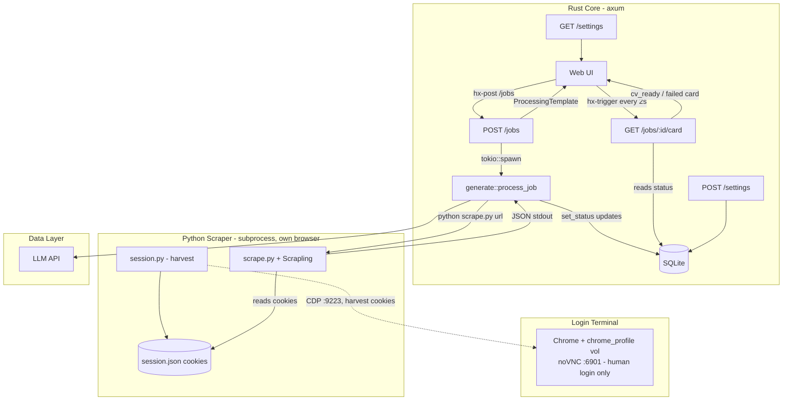

# AI Job Application Agent - Comprehensive Architecture Specification

## 1. System Overview & Design Philosophy

This document outlines the complete architecture for an autonomous, AI-driven job application agent. The system scrapes job postings from Indonesian job boards, generates highly tailored CVs based on a master profile, and queues them for user approval before submission.

### 1.1. Scope & Phasing

`indonesia_job_sites_scraping_targets.xlsx` enumerates 43 Indonesian job boards across 6 categories (General, Tech, Freelance, Entry-Level, Government, Remote-First). Supporting all of them up front is speculative — selectors, pagination, and bot-detection differ per site. **Phase 1 ships exactly one site end-to-end; the rest are deferred until the pipeline is proven.**

| Phase | Scope | Exit criteria |
|-------|-------|---------------|
| **1 (current)** | **JobStreet Indonesia** (`id.jobstreet.com`) only — individual job URL → scrape → CV → approve/reject | One JobStreet URL flows through the full UI without manual intervention; selectors stable across 10 sample URLs |
| 2 (later) | Add sites one at a time, ordered by the xlsx category priority: General first (Karir.com, Kalibrr), then Tech (Glints), then the rest | Each site gets its own selector profile only when its first URL is tested |
| 3 (later) | Listing/discovery mode (scrape `…/jobs` index pages, surface many jobs at once) | Only if Phase 1+2 per-URL flow proves insufficient — YAGNI until then |

**Phase 1 contract:** the user pastes a single `https://id.jobstreet.com/jobs/…` URL. Everything outside that — other domains, listing pages, batch imports — is out of scope and should be rejected with a clear error, not silently attempted.

### 1.2. Technology Stack
| Layer | Choice | Why |
|-------|--------|-----|
| Backend | Rust + axum | Compiler errors as dev feedback loop; reliable long-running async |
| UI | HTMX + askama + Pico CSS | No JS framework; template errors are `cargo check` errors; zero-build CSS |
| Live status | HTMX polling | `hx-trigger="every 2s"` swaps the card when the job finishes; no SSE, no extra deps |
| Scraper | Python + Scrapling | Launches its own headless browser seeded with cookies harvested from the login terminal (§2.4); invoked as a subprocess, JSON on stdout |
| Login terminal | KasmVNC Chrome container | A real human logs in here; `session.py` harvests the session over CDP. Not used for scraping (too slow/inconsistent) — no host Brave, portable across machines |
| Database | SQLite + sqlx | Single-user local file; `sqlx-cli` for migrations; zero daemon |
| LLM | Configurable via env | `LLM_MOCK=true` returns hardcoded JSON for offline dev |
| Packaging | docker compose | Whole stack (login + app) in one compose; deploys on any Linux VM/LXC (§9) |
| CI | self-hosted GitHub Actions | `cargo check`/`test` + project self-checks on every push/PR (§9) |

### 1.3. Module Structure

```
Makefile                  dev target: migrate + run (SQLite, no Docker)
scrape.py                 Python scraper, invoked as a subprocess

src/
  main.rs                 AppState, axum router, all route handlers
  generate.rs             job pipeline: scrape subprocess, prompt, LLM
  db.rs                   all sqlx query functions
  templates.rs            all askama Template structs

templates/
  base.html               <head>, Pico CSS, HTMX (CDN), nav
  index.html              dashboard: job list + submit form
  job.html                two-panel CV review
  settings.html           master CV editor
  fragments/
    job_row.html          single job row
    processing.html       polling card (hx-trigger every 2s)
    cv_ready.html         terminal card shown when generation completes

migrations/
  0001_init.sql           initial schema (run via sqlx-cli)
```

### 1.4. High-Level Architecture Diagram



---

## 2. Development Environment

### 2.1. Prerequisites

```bash
# Arch Linux
pacman -S rustup python python-pip sqlite docker docker-compose
cargo install cargo-watch sqlx-cli
pip install "scrapling[all]"         # parser + fetchers + shell + ai (bare `scrapling` lacks fetchers)
scrapling install                    # browsers + system deps for DynamicFetcher
```

### 2.2. Makefile

SQLite is a local file — no daemon, no Docker. The scraper is a subprocess Rust spawns per job, so there is nothing to start or stop alongside the server.

```makefile
.PHONY: dev migrate

DATABASE_URL = sqlite://jobagent.db

migrate:
	DATABASE_URL=$(DATABASE_URL) sqlx database create
	DATABASE_URL=$(DATABASE_URL) sqlx migrate run

dev: migrate
	DATABASE_URL=$(DATABASE_URL) cargo watch -x run
```

### 2.3. Mock LLM Mode

Set `LLM_MOCK=true` in your shell to skip real LLM calls during development. The mock returns a valid hardcoded JSON CV so the full UI flow works offline.

```bash
LLM_MOCK=true make dev
```

### 2.4. Browser Container (KasmVNC) — login terminal, not the scraper

The KasmVNC container exists for one thing: a **real human logs into the job boards in it**. It is *not* used for scraping — driving page loads through the interactive VNC browser is slow and inconsistent. The session it holds is harvested once (cookies), and the scraper runs its own fast headless browser seeded with those cookies.

**Two steps, decoupled:**

1. **Login + harvest** (container up, human in the loop):
   ```bash
   docker compose up -d login    # root compose is canonical (§9)
   # noVNC UI → http://localhost:6901   (password from VNC_PW, default admin1)
   # …log into id.jobstreet.com in the noVNC browser…
   python session.py        # harvests cookies → ~/.local/share/job-agent/session.json
   ```
   The login itself persists in the named volume `chrome_profile` across restarts and rebuilds; `session.py` just reads the current cookies out over CDP.

2. **Scrape** (container may be down): `scrape.py` launches its own browser, injects `session.json`, scrapes. No dependency on the container at scrape time → fast and consistent. Cookies are browser-agnostic, so the scraper's own browser need not match the login terminal's Chrome.

**CDP endpoint:** Chrome exposes CDP on `127.0.0.1:9222` inside the container; `entrypoint.sh` forwards it to `0.0.0.0:9223` (published on `:9223`). `session.py` reads `CDP_URL` (default `http://localhost:9223`) to harvest — the **only** thing the scrape path uses that port for. On the host (`make dev`) that's `http://localhost:9223`; inside the compose stack the app uses `http://login:9223` (§9).

| Port | Purpose |
|------|---------|
| 6901 | noVNC web UI — user logs in here |
| 9223 | CDP endpoint — `session.py` harvests cookies here |

When scraping starts hitting a login wall (cookies expired), re-login in the noVNC UI and re-run `session.py` — no rebuild, no code change. `session.json` is an auth credential: gitignored, lives outside the repo. The SSL-only pitfall (why `VNCOPTIONS` carries `-sslOnly 0`) is documented in `login/Dockerfile`.

---

## 3. Database Schema

One CV per job, stored as a JSON column on the job row — no separate versions table, no full-text index (there is no search feature).

**`migrations/0001_init.sql`**
```sql
CREATE TABLE jobs (
    id TEXT PRIMARY KEY,                 -- uuid v4 as TEXT: Uuid::new_v4().to_string()
    url TEXT UNIQUE NOT NULL,
    title TEXT,
    description TEXT,
    cv TEXT,                             -- JSON CV the LLM returned (one per job)
    -- new | scraping | generating | pending_approval | approved | rejected | failed
    status TEXT DEFAULT 'new'
);

-- Single-row settings table; upsert on save
CREATE TABLE settings (
    id INTEGER PRIMARY KEY CHECK (id = 1),
    master_cv TEXT NOT NULL DEFAULT ''
);
INSERT INTO settings (id, master_cv) VALUES (1, '');
```

---

## 4. Python Scraper

**Phase 1 scope:** a plain CLI script invoked once per job with a single `id.jobstreet.com` URL. Not a service, not a crawler — Rust spawns it as a subprocess: `python scrape.py <url>`. It prints `{"title", "description"}` as JSON on stdout; any failure exits non-zero with a traceback on stderr, which Rust logs. Non-JobStreet URLs should be rejected by the caller (Rust) before reaching the scraper; the scraper assumes a JobStreet job-detail page. The KasmVNC container is a **login terminal only** — driving page loads through the interactive VNC browser is slow and inconsistent. Instead `session.py` harvests the logged-in cookies once over CDP (§2.4), and `scrape.py` runs its own headless browser seeded with those cookies.

Selectors below are tuned for `id.jobstreet.com` job-detail pages. They will need adjustment per site in Phase 2; do not generalize prematurely.

**`session.py`** — harvest the login session from the KasmVNC Chrome over CDP. Run after logging in via noVNC; re-run when cookies expire. The container can be down afterwards.
```python
# Harvests id.jobstreet.com login cookies from the KasmVNC Chrome (over CDP) → session.json.
# This is the ONLY use of the container's CDP port; scraping never drives the VNC browser.
# ponytail: raw playwright connect_over_cdp — scrapling already depends on playwright
import json, os
from pathlib import Path
from playwright.sync_api import sync_playwright

CDP_URL = os.environ.get("CDP_URL", "http://localhost:9223")
HOST    = os.environ.get("SESSION_HOST", "jobstreet.com")
OUT     = Path(os.environ.get("SESSION_FILE",
             str(Path.home() / ".local" / "share" / "job-agent" / "session.json")))

OUT.parent.mkdir(parents=True, exist_ok=True)
with sync_playwright() as p:
    browser = p.chromium.connect_over_cdp(CDP_URL)   # attach to the running KasmVNC Chrome
    ctx = browser.contexts[0]                         # default context holds the login
    cookies = [c for c in ctx.cookies(f"https://{HOST}") if HOST in c["domain"]]
    json.dump(cookies, OUT.open("w"))
print(f"wrote {len(cookies)} cookies → {OUT}")
```

**`scrape.py`** — runs its **own** headless browser seeded with the harvested cookies. The KasmVNC container is not in the scrape path.
```python
# Invoked as: python scrape.py <url>  →  prints {"title", "description"} JSON on stdout.
# Launches its OWN headless browser (Scrapling) seeded with cookies harvested from the
# KasmVNC session. It never drives the VNC browser — that is slow and inconsistent (§2.4).
# ponytail: Phase 1 — DynamicFetcher + hardcoded jobstreet selectors. If anti-bot bites,
# swap to StealthyFetcher (bypasses Cloudflare out of the box). For Phase 2 site churn, use
# adaptive=True / auto_save so Scrapling relocates selectors when pages change.
import os, sys, json, asyncio
from pathlib import Path
from scrapling.fetchers import DynamicFetcher

SESSION_FILE = Path(os.environ.get("SESSION_FILE",
    str(Path.home() / ".local" / "share" / "job-agent" / "session.json")))


def load_cookies():
    if not SESSION_FILE.exists():
        sys.exit(f"no session at {SESSION_FILE} — run `python session.py` after logging in via noVNC (§2.4)")
    return json.loads(SESSION_FILE.read_text())


async def scrape(url: str) -> dict:
    # Own headless browser; the harvested cookies carry the logged-in session.
    page = await DynamicFetcher.async_fetch(url, cookies=load_cookies(),
                                            network_idle=True, headless=True)
    # JobStreet job-detail selectors. title first; fall back to h1 if the
    # data-automation attribute is renamed.
    title = (page.css_first('[data-automation="job-detail-title"]::text')
             or page.css_first('h1::text') or "")
    desc  = (page.css_first('[data-automation="jobDescriptionText"]')
             or page.css_first('[data-automation="jobDescription"]'))
    return {"title": title.strip(),
            "description": desc.text.strip() if desc else ""}


if __name__ == "__main__":
    print(json.dumps(asyncio.run(scrape(sys.argv[1]))))
```

---

## 5. Rust Core

### 5.1. Cargo.toml

```toml
[package]
name    = "job-agent"
version = "0.1.0"
edition = "2021"

[dependencies]
axum        = { version = "0.7", features = ["macros", "form"] }
tokio       = { version = "1",   features = ["full"] }
sqlx        = { version = "0.7", features = ["runtime-tokio", "sqlite", "uuid"] }
reqwest     = { version = "0.12", features = ["json"] }
serde       = { version = "1",   features = ["derive"] }
serde_json  = "1"
uuid        = { version = "1",   features = ["v4"] }
anyhow      = "1"
askama      = "0.12"
askama_axum = "0.4"
```

### 5.2. AppState

**`src/main.rs`**
```rust
#[derive(Clone)]
pub struct AppState {
    pub db:           sqlx::SqlitePool,
    pub http:         reqwest::Client,   // LLM calls only; scraper is a subprocess
    pub llm_endpoint: String,
    pub llm_api_key:  String,
    pub llm_model:    String,
    pub mock_llm:     bool,   // LLM_MOCK set → skip real API calls
}

impl AppState {
    pub fn from_env(db: sqlx::SqlitePool) -> Self {
        Self {
            db,
            http:         reqwest::Client::new(),
            llm_endpoint: std::env::var("LLM_ENDPOINT").expect("LLM_ENDPOINT required"),
            llm_api_key:  std::env::var("LLM_API_KEY").expect("LLM_API_KEY required"),
            llm_model:    std::env::var("LLM_MODEL")
                              .unwrap_or("claude-sonnet-4-6".into()),
            mock_llm:     std::env::var("LLM_MOCK").is_ok(),
        }
    }
}
```

### 5.3. Template Structs

**`src/templates.rs`**
```rust
use askama::Template;
use uuid::Uuid;

#[derive(Template)]
#[template(path = "index.html")]
pub struct IndexTemplate {
    pub jobs: Vec<JobRow>,
}

pub struct JobRow {
    pub id:     Uuid,
    pub title:  String,
    pub status: String,
}

#[derive(Template)]
#[template(path = "job.html")]
pub struct JobTemplate {
    pub id:          Uuid,
    pub title:       String,
    pub description: String,
    pub cv:          CvContent,
}

pub struct CvContent {
    pub summary:     String,
    pub skills:      Vec<String>,
    pub experiences: Vec<Experience>,
}

pub struct Experience {
    pub company:       String,
    pub role:          String,
    pub bullet_points: Vec<String>,
}

#[derive(Template)]
#[template(path = "fragments/processing.html")]
pub struct ProcessingTemplate {
    pub id:  Uuid,
    pub url: String,
}

#[derive(Template)]
#[template(path = "fragments/cv_ready.html")]
pub struct CvReadyTemplate {
    pub id:    Uuid,
    pub title: String,
}

#[derive(Template)]
#[template(path = "settings.html")]
pub struct SettingsTemplate {
    pub master_cv: String,
}
```

### 5.4. Scrape Helper (subprocess, in `generate.rs`)

```rust
use tokio::time::{sleep, Duration};

// ponytail: subprocess, 3s courtesy delay + one retry; add backoff if bot-detection bites
async fn fetch_job(url: &str) -> anyhow::Result<serde_json::Value> {
    sleep(Duration::from_secs(3)).await;
    if let Ok(v) = scrape_once(url).await {
        return Ok(v);
    }
    sleep(Duration::from_secs(10)).await;
    scrape_once(url).await
}

async fn scrape_once(url: &str) -> anyhow::Result<serde_json::Value> {
    let out = tokio::process::Command::new("python")
        .arg("scrape.py").arg(url)
        .output().await?;
    anyhow::ensure!(out.status.success(),
        "scrape.py failed: {}", String::from_utf8_lossy(&out.stderr));
    Ok(serde_json::from_slice(&out.stdout)?)
}
```

### 5.5. Prompt Builder (in `generate.rs`)

```rust
use serde_json::Value;

fn build_prompt(task: &str, context: Value, output_schema: Value) -> String {
    let ctx    = serde_json::to_string_pretty(&context).unwrap_or_default();
    let schema = serde_json::to_string_pretty(&output_schema).unwrap_or_default();
    format!(r###"
### CONTEXT
{ctx}
### TASK
{task}
### OUTPUT FORMAT
Return ONLY valid JSON matching this exact structure. No markdown, no explanation.
{schema}
"###)
}
```

### 5.6. CV Generation Pipeline

Job record is created before spawning so the polling fragment has an ID to watch immediately. Errors set status to `failed` so the next poll surfaces them to the user.

**`src/generate.rs`**
```rust
use anyhow::Result;
use serde_json::{json, Value};
use uuid::Uuid;
use crate::{AppState, db};

pub async fn process_job(app: &AppState, job_id: Uuid) -> Result<()> {
    db::set_status(&app.db, job_id, "scraping").await?;

    let url        = db::get_job_url(&app.db, job_id).await?;
    let job_data   = fetch_job(&url).await?;
    db::update_job_data(&app.db, job_id, &job_data).await?;

    db::set_status(&app.db, job_id, "generating").await?;

    let master_cv  = db::get_master_cv(&app.db).await?;
    let context    = json!({
        "job_description": job_data["description"],
        "master_cv":       master_cv,
    });
    let task = "Analyze master_cv against job_description. \
                Extract and rephrase experiences to match the job requirements.";
    let schema = json!({
        "summary":     "String: 2-3 sentences tailored to the job.",
        "skills":      ["Array of strings: technical skills matching JD"],
        "experiences": [{"company": "String", "role": "String",
                         "bullet_points": ["achievement-focused, quantified"]}]
    });

    let cv = call_llm(app, &build_prompt(task, context, schema)).await?;
    db::save_cv_draft(&app.db, job_id, cv).await?;   // UPDATE jobs SET cv = ?  (bind cv.to_string())
    db::set_status(&app.db, job_id, "pending_approval").await?;
    Ok(())
}

async fn call_llm(app: &AppState, prompt: &str) -> Result<Value> {
    if app.mock_llm {
        // ponytail: mock returns valid structure so full UI flow works offline
        return Ok(json!({
            "summary": "Mock summary for development.",
            "skills": ["Rust", "Python", "PostgreSQL"],
            "experiences": [{
                "company": "Mock Corp",
                "role": "Mock Engineer",
                "bullet_points": ["Achieved mock results", "Delivered mock features"]
            }]
        }));
    }
    // Real LLM call via LLM_ENDPOINT / LLM_API_KEY / LLM_MODEL
    let resp = app.http
        .post(&app.llm_endpoint)
        .bearer_auth(&app.llm_api_key)
        .json(&json!({ "model": app.llm_model, "prompt": prompt }))
        .send().await?
        .json::<Value>().await?;
    Ok(resp)
}
```

### 5.7. Routes & Polling

**`src/main.rs` (route handlers)**
```rust
// POST /jobs — create stub record, spawn background task, return polling card immediately.
// ponytail: Phase 1 — reject non-id.jobstreet.com URLs at the boundary, not in the scraper
async fn submit_job(
    State(app): State<AppState>,
    Form(body): Form<JobForm>,
) -> impl IntoResponse {
    if !is_phase1_url(&body.url) {
        return Html(
            "<article><span class=\"error\">Phase 1 supports id.jobstreet.com URLs only.</span></article>"
        ).into_response();
    }
    let job_id = db::create_job_stub(&app.db, &body.url).await
        .expect("failed to create job record");

    tokio::spawn({
        let app = app.clone();
        async move {
            if let Err(e) = generate::process_job(&app, job_id).await {
                eprintln!("process_job {job_id} failed: {e}");
                let _ = db::set_status(&app.db, job_id, "failed").await;
            }
        }
    });

    ProcessingTemplate { id: job_id, url: body.url }.into_response()
}

// ponytail: hardcoded host allowlist; replace with config-driven list in Phase 2
fn is_phase1_url(url: &str) -> bool {
    reqwest::Url::parse(url).ok()
        .and_then(|u| u.host_str().map(|h| h == "id.jobstreet.com"))
        .unwrap_or(false)
}

// GET /jobs/:id/card — HTMX polls this every 2s; the returned card stops polling
// at a terminal status (no hx-trigger on the ready/failed fragments).
async fn job_card(
    Path(job_id): Path<Uuid>,
    State(app): State<AppState>,
) -> Response {
    match db::get_status(&app.db, job_id).await.unwrap_or_default().as_str() {
        "pending_approval" => db::render_cv_ready(&app.db, job_id).await.into_response(),
        "failed" => Html(format!(
            "<article id=\"job-{job_id}\"><span class=\"error\">Processing failed.</span></article>"
        )).into_response(),
        // still in-flight → re-render the polling card so hx-trigger keeps firing
        _ => {
            let url = db::get_job_url(&app.db, job_id).await.unwrap_or_default();
            ProcessingTemplate { id: job_id, url }.into_response()
        }
    }
}

pub fn router(state: AppState) -> Router {
    Router::new()
        .route("/",                  get(index))
        .route("/jobs",              post(submit_job))
        .route("/jobs/:id",          get(job_detail))
        .route("/jobs/:id/card",     get(job_card))
        .route("/jobs/:id/decision", post(job_decision))
        .route("/settings",          get(settings_page).post(save_settings))
        .with_state(state)
}
```

---

## 6. Web UI

### 6.1. Base Template

**`templates/base.html`**
```html
<!DOCTYPE html>
<html lang="en" data-theme="light">
<head>
  <meta charset="utf-8">
  <meta name="viewport" content="width=device-width, initial-scale=1">
  <title>Job Agent</title>
  <link rel="stylesheet"
        href="https://cdn.jsdelivr.net/npm/@picocss/pico@2/css/pico.min.css">
  <script src="https://cdn.jsdelivr.net/npm/htmx.org@2/dist/htmx.min.js"></script>
</head>
<body>
  <main class="container">
    <nav>
      <ul><li><strong>Job Agent</strong></li></ul>
      <ul>
        <li><a href="/">Jobs</a></li>
        <li><a href="/settings">Settings</a></li>
      </ul>
    </nav>
    
  </main>
</body>
</html>
```

### 6.2. Dashboard

**`templates/index.html`**
```html


<form hx-post="/jobs" hx-target="#job-list" hx-swap="afterbegin">
  <input name="url" type="url"
         placeholder="Paste an id.jobstreet.com job URL…"
         pattern="https://id\.jobstreet\.com/.*"
         title="Phase 1 supports id.jobstreet.com URLs only"
         required>
  <button type="submit">Process</button>
</form>
<div id="job-list">
  
</div>

```

### 6.3. Polling Fragment Flow

Submit returns `processing.html` immediately. The fragment polls `GET /jobs/:id/card` every 2s and swaps itself with the result. The card it gets back keeps the `hx-trigger` while the job is in-flight and drops it once the job reaches `pending_approval` (CV ready) or `failed` — so polling stops on its own.

**`templates/fragments/processing.html`**
```html
<article id="job-{{ id }}"
         hx-get="/jobs/{{ id }}/card"
         hx-trigger="every 2s"
         hx-swap="outerHTML"
         aria-busy="true">
  Processing {{ url }}…
</article>
```

**`templates/fragments/cv_ready.html`**
```html
<article id="job-{{ id }}">
  <strong>{{ title }}</strong>
  <a href="/jobs/{{ id }}" role="button" class="outline">Review CV →</a>
</article>
```

### 6.4. CV Review Page

**`templates/job.html`**
```html


<div class="grid">
  <section>
    <h2>Job Description</h2>
    <pre style="white-space:pre-wrap">{{ description }}</pre>
  </section>
  <section>
    <h2>Generated CV</h2>
    <p>{{ cv.summary }}</p>
    <ul><li>{{ s }}</li></ul>
    
      <h3>{{ exp.role }} — {{ exp.company }}</h3>
      <ul><li>{{ bp }}</li></ul>
    

    <div style="display:flex; gap:0.5rem; margin-top:1rem">
      <button hx-post="/jobs/{{ id }}/decision"
              hx-vals='{"approved":true}'>Approve</button>
      <button class="secondary"
              onclick="document.getElementById('reject-box').style.display='block'">
        Reject
      </button>
    </div>

    <!-- Hidden until Reject is clicked -->
    <div id="reject-box" style="display:none; margin-top:0.5rem">
      <textarea id="reason" name="reason"
                placeholder="Reason for rejection…"
                style="width:100%"></textarea>
      <button hx-post="/jobs/{{ id }}/decision"
              hx-vals='{"approved":false}'
              hx-include="#reason"
              style="margin-top:0.5rem">
        Confirm Reject
      </button>
    </div>
  </section>
</div>

```

### 6.5. Settings Page (Master CV)

**`templates/settings.html`**
```html

Settings

<h1>Master CV</h1>
<p>Paste your full CV here. This is the source material for all generated CVs.</p>
<form hx-post="/settings" hx-swap="none">
  <textarea name="master_cv" rows="30"
            style="width:100%; font-family:monospace">{{ master_cv }}</textarea>
  <button type="submit">Save</button>
</form>

```

### 6.6. Environment Variables

| Variable | Required | Description |
|----------|----------|-------------|
| `DATABASE_URL` | Yes | SQLite connection string (e.g. `sqlite://jobagent.db`) |
| `LLM_API_KEY` | Yes | API key for the generation model |
| `LLM_ENDPOINT` | Yes | Base URL of the LLM API |
| `LLM_MODEL` | No | Model ID (default: `claude-sonnet-4-6`) |
| `LLM_MOCK` | No | Set to any value to skip real LLM calls |
| `CDP_URL` | No | CDP endpoint of the login terminal (default: `http://localhost:9223`); see §2.4 |

---

## 7. Execution Lifecycle

1. **First run:** bring up the login container, log into `id.jobstreet.com` once via noVNC (http://localhost:6901), then `python session.py` harvests the session cookies to `session.json` (re-run when they expire). Separately, `make dev` creates `jobagent.db` and runs migrations. Scraping runs in its own browser off `session.json` — the container can be down while scraping.
2. **Input:** User pastes a job URL and hits **Process**. Job record created with `status='new'`.
3. **Immediate response:** Server spawns `process_job` in the background; returns `processing.html` to the browser. HTMX prepends it to the job list. The fragment polls `/jobs/:id/card` every 2s.
4. **Scraping:** `fetch_job` waits 3s, runs `python scrape.py <url>` as a subprocess. Status → `scraping`. `scrape.py` launches its own headless browser seeded with the harvested `session.json` cookies, renders the page, and prints JSON on stdout. (The KasmVNC container is not involved at scrape time.)
5. **Generation:** `build_prompt` assembles the prompt from job description + master CV. Status → `generating`. LLM returns structured JSON CV (or mock if `LLM_MOCK` is set).
6. **Poll resolves:** Status → `pending_approval`. The next `/card` poll returns `cv_ready.html` (no `hx-trigger`, so polling stops). If `process_job` errors at any step, status → `failed` and `/card` returns the failed card.
7. **Review:** User clicks **Review CV →**, sees side-by-side job description and generated CV.
8. **Decision:** User clicks **Approve** or **Reject** (with confirm step + reason textarea). Status updated in database.

---

## 8. Multi-Agent Workspace

Multiple agents work this repo in parallel — they cannot share a single working directory without colliding on file edits and the `target/` build cache. The project uses a **bare repo + worktree** layout with a **two-layer agent model**:

- **Controller** — one orchestrator at the project root (`JobHunting/`). Manages worktrees, dispatches worker agents, integrates their work, resolves conflicts. **Never writes project code.**
- **Workers** — one agent per milestone worktree (`m2-scrape/`, `m3-backend/`, …). Does the actual code work, verifies, commits, signals READY. **Never merges.**

Each layer has its own skills in its own `.opencode/`:

```
JobHunting/                              ← controller operates here
├── .bare/                               ← bare hub (commit/branch storage)
├── .git                                 ← file: `gitdir: ./.bare`
├── .env                                 ← shared dev env (workers source via ../.env)
├── .opencode/skills/orchestrate/SKILL.md ← controller's skill (machine-local; not in any worktree)
├── main/                                ← integration worktree on `main`
│   └── .opencode/skills/worktree/SKILL.md ← worker skill (committed; propagates to new worktrees)
└── <slug>/                              ← per-milestone worker worktree
    └── .opencode/skills/worktree/SKILL.md ← copy from main; worker may refine
```

**Skill locations:**
- Controller skill lives at project root's `.opencode/` — **not inside any worktree**, so it isn't tracked in git and doesn't propagate to workers.
- Worker skill lives inside the `main/` worktree's `.opencode/` — **committed and version-controlled**, so every `git worktree add … main` gets a copy, and worker refinements propagate back via merge.

**Agent action cards:**
- Controller: `.opencode/skills/orchestrate/SKILL.md` at the project root
- Worker: `.opencode/skills/worktree/SKILL.md` inside every worktree

### 8.1 Layout

```
JobHunting/                  ← project root; no working files live here
├── .bare/                   ← bare repo (commit/branch storage; never edited directly)
├── .git                     ← file containing `gitdir: ./.bare` (so git works from root)
├── .env                     ← shared dev env (gitignored, lives outside worktrees)
├── main/                    ← `main` branch worktree (integration / staging)
├── m2-scrape/               ← per-milestone worktrees (created on demand)
└── m3-backend/
```

### 8.2 Why bare + worktree

| Property | Effect |
|----------|--------|
| File isolation | Each agent edits in its own worktree; no concurrent writes to the same file. |
| Build isolation | Each worktree has its own `target/`, so concurrent `cargo build` doesn't contend. |
| Shared history | All worktrees share the bare hub; commits in one are visible to others via `git log --all` immediately. No push/pull between them. |
| Cheap context switch | `cd ../m3-backend` switches branch+files atomically; no stashing. |

### 8.3 Dispatching a milestone (controller → worker)

The controller picks the next milestone from `PLANS.md`, creates the worktree, and spawns a worker agent inside it:

```bash
# Controller, from project root
git worktree add m2-scrape -b m2-scrape main
# spawn worker agent with cwd=m2-scrape/, briefed to read .opencode/skills/worktree/SKILL.md
```

The worker reads its skill, runs `make dev` to verify boot, does the work, commits. `make dev` works out of the box because `../.env` resolves to the project root config.

### 8.4 Signaling completion (worker → controller)

The worker never merges. When its PLANS.md "Done when" criteria are met, it:
1. Updates PLANS.md in its worktree (checkboxes + Status line)
2. Commits with `<slug> complete`
3. Prints `READY: <slug> ready for merge` and stops

The controller then integrates:

```bash
# Controller, from project root
cd main
git merge m2-scrape
# resolve conflicts per §8.5
git worktree remove ../m2-scrape
git branch -d m2-scrape
```

If the worker cannot finish, it prints `BLOCKED: <slug> — <reason>` and stops; the controller escalates or sends the worker back.

`main` is the only branch that ever gets pushed to a remote (when one is added). The bare hub is the local source of truth — never push between worktrees.

### 8.5 Conflict resolution (controller)

When two worker branches diverge (e.g. parallel workers both updated PLANS.md), the controller resolves by category:

| Conflict location | Resolution |
|-------------------|------------|
| Code in the milestone's scope | Worker's version wins |
| Code outside the milestone's scope | `main` wins; flag as scope creep to user |
| `PLANS.md` | Union both sides: checkboxes stay checked if either side checked them; keep more recent Status line |
| `.opencode/skills/` | Prefer the more specific/refined version; if meaningful divergence, reconcile manually and document in commit message |
| `.gitignore` | Union both sides — never lose an ignore pattern; if one side removed a pattern, keep it and investigate why |

### 8.6 Shared vs per-worktree state

| Path | Scope | Why |
|------|-------|-----|
| `.env` | Shared (project root) | One config; Makefile sources `../.env` from any worktree |
| `target/` | Per-worktree | Avoid concurrent-build contention; rebuilds are ~1m once, 0.3s after |
| `jobagent.db` | Per-worktree | Each agent gets isolated test data; merge never touches DB state |
| `login` container, `chrome_profile` volume, `session.json` | Shared (machine-wide) | One login terminal; `session.py` harvests cookies that every worktree's scraper reuses in its own browser |

### 8.7 Remote sync (publishing)

The bare hub has `origin → https://github.com/menggatot/JobHunting.git` (private). **Only the controller pushes, only from `main/`, only after a clean integration, only on explicit user instruction.** Workers never see `origin`.

```bash
# Controller, after a clean integration commit on main/
cd main
git push origin main
```

If working solo, no `git pull` needed before push — nobody else writes to GitHub. If collaborating, `git pull --rebase origin main` first. Never push worker branches directly; the integration flow is `worker → main (merge) → origin (push)` — GitHub only ever sees the polished history of `main`.

### 8.8 Repo setup commands (one-time, already applied)

```bash
mkdir JobHunting && cd JobHunting
git clone --bare <source> .bare
echo "gitdir: ./.bare" > .git              # so `git worktree …` works from project root
git -C .bare remote add origin https://github.com/<user>/JobHunting.git
git -C .bare config remote.origin.fetch "+refs/heads/*:refs/remotes/origin/*"
git worktree add main                       # creates main/ worktree on `main` branch
git -C main push -u origin main             # initial publish
```

---

## 9. Deployment & CI

### 9.1 Container topology

The whole stack is one `docker compose` (root `docker-compose.yml`) — the only host requirement is Docker. No toolchain reproduction per machine.

| Service | Image | Role | Port |
|---------|-------|------|------|
| `login` | `./login` (KasmVNC Chrome) | Human logs in; `session.py` harvests cookies over CDP | 6901 (noVNC, published), 9223 (CDP, internal to the compose net) |
| `app` | `.` multi-stage: Rust + Python/Scrapling + Chromium — **M8** | Web UI; spawns `scrape.py` in-container with its own browser | 3000 (published) |

Volumes: `chrome_profile` (login session), `app_data` (SQLite + `session.json`). The scraper's own Chromium stays separate from the login browser (§2.4).

### 9.2 Deploy on a VM or LXC

```bash
git clone <repo> && cd JobHunting
cp .env.example .env     # fill LLM_* ; set VNC_PW for a non-default login password
docker compose up -d     # login terminal now; app joins in M8
# → open http://<host>:6901, log into id.jobstreet.com, then harvest (M8: `docker compose exec app python session.py`)
```

- **VM:** install Docker, done.
- **LXC:** enable `nesting=1` (and `keyctl=1` on some base images) on the container, install Docker inside, then the same compose.

### 9.3 CI — self-hosted GitHub Actions

`.github/workflows/ci.yml` runs on a **self-hosted** runner on every push/PR to `main`:

1. `cargo check --all-targets` + `cargo test` — the Rust gates. Tests land in M3–M7; CI runs them automatically as they appear.
2. Project self-checks — `AGENTS.md` under its 4 KB cap, and no secrets/DBs/`session.json` tracked.

**Register a runner** (one-time, user action): repo → Settings → Actions → Runners → New self-hosted runner → follow the Linux x64 steps on the host/VM that will run jobs. The workflow uses `dtolnay/rust-toolchain`, so the runner needs no pre-installed Rust.

**CD** (continuous deploy) is M8+: on push to `main`, the runner rebuilds the images and restarts the stack on the target VM. Not wired today — the app must exist first.
